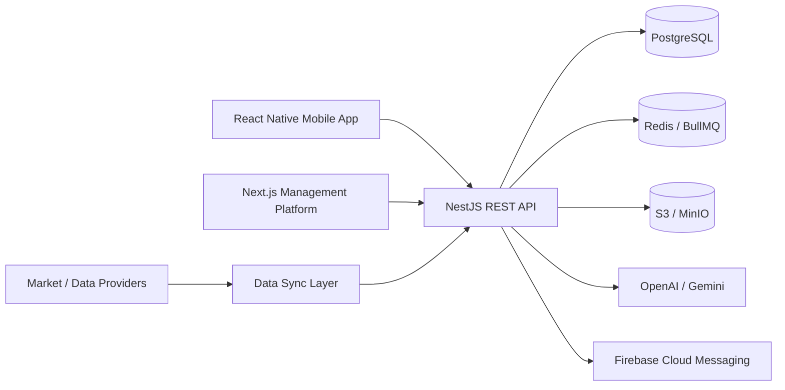

<div align="center">

# 🛒 Akıllı Sepet

### Smart Grocery Price Comparison, Cart Optimization & Product Safety Platform

**Compare supermarket prices, optimize a complete shopping cart, scan products by barcode and contribute to a community-driven product safety network.**


**🏆 Outstanding Project Award — Recognized among the best graduation projects**

**Computer Engineering Graduation Project · Developed by Alperen İVAK**

</div>

---

## 🏆 Recognition

**Akıllı Sepet received the Outstanding Project Award from Eastern Mediterranean University (EMU/DAÜ), recognizing it among the best graduation projects.**

The recognition reflects the project's combination of a real-world consumer problem, end-to-end software engineering, mobile and backend development, data-driven price intelligence, community participation and a production-oriented system architecture.

## Overview

**Akıllı Sepet** is a full-stack grocery intelligence platform designed to make everyday shopping more transparent, economical and safer.

Instead of treating price comparison as a simple product search, the platform combines **market price intelligence**, **whole-cart optimization**, **barcode-based product discovery**, **price history**, **community contributions**, **expired-product reporting** and an **AI-supported shopping assistant** in a single ecosystem.

The project is implemented as a production-oriented monorepo containing a mobile application, a REST API and role-based management panels.

## Core Product Capabilities

| Capability | What it does |
|---|---|
| **Price Comparison** | Compares the same product across supported supermarkets and surfaces the most advantageous option. |
| **Smart Cart Optimization** | Evaluates an entire basket and helps identify lower-cost shopping combinations. |
| **Barcode Scanning** | Lets users identify products quickly through the mobile camera and barcode pipeline. |
| **Price History** | Tracks historical product prices to make price changes easier to understand. |
| **Price Alerts** | Allows users to follow products and receive notifications when target conditions are met. |
| **Community Price Intelligence** | Accepts user-submitted market/product price contributions through a moderation workflow. |
| **Expired Product Reporting** | Enables users to report products whose expiration date has passed, with supporting evidence. |
| **Reputation & Rewards** | Rewards useful community contributions and builds user reputation over time. |
| **AI Shopping Assistant** | Provides contextual assistance for product and shopping-related questions. |
| **Offline Experience** | Keeps selected mobile flows usable with local caching and synchronization support. |

## Platform

### 📱 Mobile Application

Built with **React Native + Expo**, the consumer application includes product search, market browsing, barcode scanning, product details, price comparison, price history, cart management, optimized shopping suggestions, notifications, catalog browsing, reports, account management and AI-assisted flows.

### ⚙️ Backend API

The backend is built with **NestJS**, **Prisma ORM** and **PostgreSQL**. It is organized into modular domains covering authentication, users, products, markets, prices, carts, reports, catalogs, notifications, data synchronization, scraping/provider integrations, AI and administrative operations.

### 🖥️ Management Platform

The **Next.js** management interface provides dedicated workflows for system administrators, inspectors and market managers. It supports operational dashboards, product and market management, report review, data synchronization and role-specific moderation tasks.

## Architecture



## Technology Stack

| Layer | Technologies |
|---|---|
| Mobile | React Native, Expo, Expo Router, Zustand, React Query |
| Admin | Next.js, TypeScript, Tailwind CSS |
| Backend | NestJS, TypeScript, Prisma ORM |
| Database | PostgreSQL |
| Cache / Jobs | Redis, BullMQ |
| Object Storage | MinIO / S3-compatible storage |
| AI | OpenAI, Google Gemini |
| Notifications | Firebase Cloud Messaging |
| Authentication | JWT access & refresh tokens, email OTP |
| Infrastructure | Docker Compose, Nginx |

## Security & Reliability

The platform includes role-based authorization, JWT-based authentication, password hashing, email verification, request validation, environment-based configuration and operational security documentation. Sensitive values are expected to be supplied through environment variables rather than committed credentials.

Detailed notes are available in [`docs/SECURITY.md`](docs/SECURITY.md).

## Repository Structure

```text
akilli-sepet/
├── mobile/              # React Native / Expo consumer application
├── backend/             # NestJS API, Prisma and background services
├── admin-panel/         # Next.js role-based management platform
├── docs/                # Security, deployment and architecture documentation
├── nginx/               # Reverse-proxy configuration
├── docker-compose.yml   # Local infrastructure
└── docker-compose.prod.yml
```

## Local Development

### Requirements

- Node.js 18+
- npm / pnpm
- PostgreSQL
- Redis
- Docker & Docker Compose (recommended)

### 1. Clone the repository

```bash
git clone https://github.com/alperenivak/akilli-sepet.git
cd akilli-sepet
```

### 2. Configure environment variables

```bash
cp .env.example .env
```

Fill in the required local credentials and service keys before starting the application.

### 3. Install dependencies

```bash
npm install
```

### 4. Start development services

```bash
npm run dev
```

Mobile development can be started separately from the `mobile` directory when needed.

## API & Engineering Documentation

The backend exposes API documentation through Swagger when enabled by the deployment configuration. Additional engineering material is maintained under [`docs/`](docs/), including security guidance, deployment notes, architectural decisions and incident-response documentation.

## Product Principles

Akıllı Sepet was designed around three ideas:

1. **Price transparency** — users should be able to understand where their basket is more economical.
2. **Community intelligence** — verified user contributions can improve price coverage and product-safety awareness.
3. **Practical engineering** — mobile, backend, admin, data synchronization, security and deployment should work as one coherent product rather than isolated course modules.

## Project Status

The core platform, authentication flow, mobile application, management panels, price comparison, cart optimization, barcode flows, reporting, notification infrastructure and data synchronization foundations are implemented. The repository continues to evolve as integrations and production coverage are expanded.

## Author

**Alperen İVAK**  
Computer Engineering

This repository is maintained as a portfolio and engineering project. If you find the architecture or product idea useful, consider giving the repository a ⭐.
